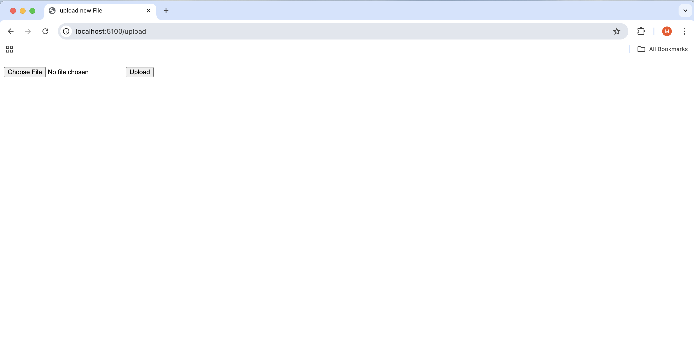
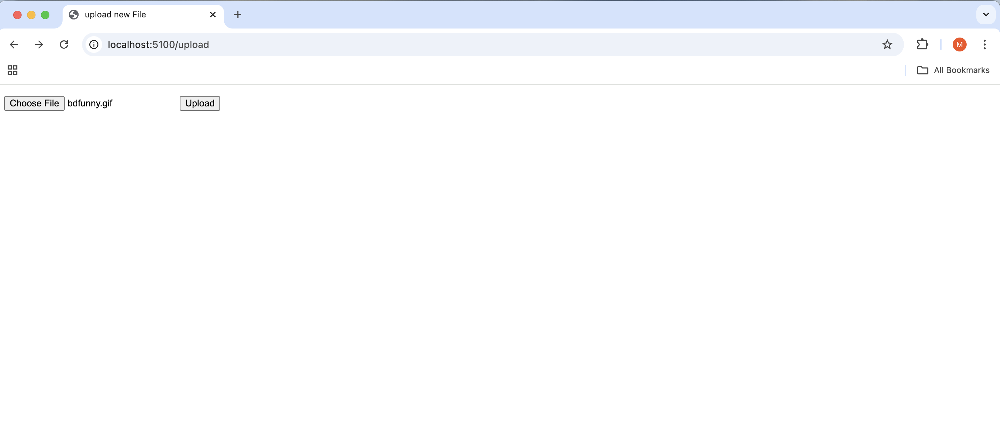
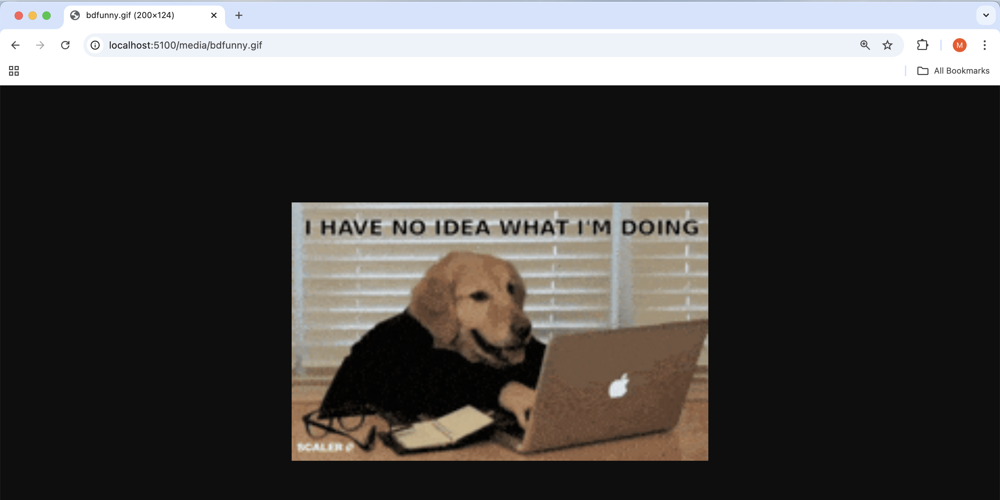

# Instagram tech stack buildout with Flask and Docker

## Overview

This repo follows the [TestDriven.io](https://testdriven.io/blog/dockerizing-flask-with-postgres-gunicorn-and-nginx/) tutorial to set up a Flask-based web service using Docker. The build out is an approximation of Instagram's tech stack. I use Docker, PostGres, Gunicorn and Nginx to enable this web service. This web service allows you to host static files, as well as upload media and view it on the web service. Admittedly, this build is bare bones, and additional content and functionality can be developed following the fundamentals already established here.

**Example file upload**

In the screenshots below, you can see me uploading a gif file to the web service.

Firstly, the upload functionality on the web service is accessed. In my configuration, this is at the address `http://localhost:5100/`


Secondly, a gif is uploaded


Thirdly, the gif can be previewed on a newly established page!



## Build instructions

This service has both development and production environments, and consequently there are two seperate compose files that can be used to bring the service up. Please note, that for security reasons, some files containing sensitive information were not uploaded to this repository, and they must be added separetely by you to ensure complete and proper functionality of the web service.

** Development **

You can build the development side of the web service by simply bringing up the development container using the following command:

```
$ docker-compose up -d --build
```

Ensure no other competing containers are running, and use port forwarding if necessary. 
